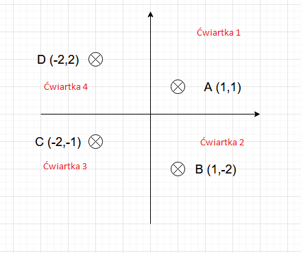

## Wstęp do C#

### Typy proste

#### Zadanie 1

W klasie `TypyProste.cs` utwórz zmienne typu
1. int a
2. char b
3. double c
4. long d 
5. bool e

I nadaj im dowolne prawidłowe wartości.


#### Zadanie 2

W klasie `TypyProste.cs` do zmiennej `int a` dodaj liczbę `2147483647`. 

Jaki otrzymałeś wynik? Czy potrafisz wytłumaczyć co się stało?

#### Zadanie 3

Wklej i uruchom kod. Czy przed uruchomieniem wiesz jaką wartość przyjmie zmienna `warunek` i dlaczego?
```csharp
double y = 0.1;
double z = 0.2;
bool warunek = y + z == 0.3;
Console.WriteLine(warunek);
```


### Typy obiektowe

Wszystkie zadania wykonaj w klasie `TypyObiektowe.cs` w metodzie `public static void Main(string[] args)`

#### Zadanie 4

Wydrukuj w konsoli napis `Tester był "bardzo" ucieszony z powodu notorycznego ignorowania raportów błędów przez developera`

*Wskazówka: Zwróć uwagę na cudzysłów w środku stringa*


#### Zadanie 5

Utwórz zmienne i przypisz im dowolne wartości:
* `string name`
* `int age`

Wydrukuj napis w formacie "Imię, ma X lat i jest (nie)pełnoletni" w zależności od tego czy zmienna `age` jest mniejsza od 18 czy nie.

*Wskazówka: Użyj do tego zmiennych `name` oraz `age` oraz string interpolation.*

#### Zadanie 6

Stwórz zmienną typu string i wydrukuj w konsoli odwrócony napis.

*Przykład: dla napisu `Kamil Ślimak` powinniśmy otrzymać `kamilŚ limaK`*


### Warunki


#### Zadanie 7
1. Utwórz zmienną int value i nadaj jej wartość pomiędzy 0 a 100.
2. Jeżeli zmienna value jest mniejsza od zera lub większa od 100 wydrukuj napis `To nie jest akceptowalna wartość zmiennej value`
3. Jeżeli zmienna value znajduje się w przedziale <0, 100>, wydrukuj napis `Pomiar wynosi value` (użyj wartości zmiennej)
4. Zmień wartość zmienne int value na mniejszą od zera i uruchom jeszcze raz program żeby sprawdzić czy działa.

#### Zadanie 8
Napisz ten kod używając tenary operator (operatora warunkowego ?)
```csharp
double input = 5.5;
string jakiePiwo;
if (input >= 4)
{
    jakiePiwo = "mocne";
}
else
{
    jakiePiwo = "słabe";
}
```

#### Zadanie 9
Używając wyrażenia `switch` wydrukuj napis z nazwą dnia tygodnia na podstawie wartości zmiennej `int dayOfTheWeek`.

1 -> Poniedziałek, 2 -> Wtorek, ..., 7 -> Niedziela, inne wartości -> Błędny dzień


### Metody (statyczne)

Wszystkie zadania do rozwiązania w klasie `Metody.cs`. 

Działanie metod przetestuj w metodzie `public static void Main(string[] args)`

#### Zadanie 10

Napisz metodę, która zwróci wartość ceny `price` po rabacie `discount`.
Rabat ma być podany jako liczba zmiennoprzecinkowa (`20%` rabatu będzie przekazane jako wartość `0.2`)
```csharp
public static double CalculatePrice(int price, double discount)
```


#### Zadanie 11

Napisz metodę, która przyjmuje trzy liczby (a, b oraz c) i zwraca największą z nich.
```csharp
public static double MaxFrom(double a, double b, double c)
```


#### Zadanie 12

Napisz metodę, która przyjmie trzy parametry 
* `title`, 
* `author` 
* `publisher` 

Metoda ma **zwrócić** napis w postaci `Hobbit, autorstwa JR. Tolkien wydany przez Wydawnictwo X`


#### Zadanie 13

Metoda ma przyjąć cztery parametry (liczbę, cenę jednostkową, rabat oraz spodziewaną kwotę do drugiego miejsca po przecinku)
Liczba produktów (pcs) pomnożona przez cenę jednostkową (price) minus rabat procentowy od całości ma być równa oczekiwanej sumie.
Metoda ma zwrócić true (kwota się zgadza) lub false (kwota się nie zgadza)

*Podpowiedź: Użyj Math.Round() do zaokrąglenia porównywanych kwot do jednego grosza.*

```csharp
public static bool validateSumWithDiscount(int pcs, double price, double discount, double expectedSum)
```

#### Zadanie 14

Metoda `GetQuadrant()` ma przyjąć dwa parametry, współrzędne `x` oraz `y` punktu na osi współrzędnych.
Ma zwrócić (użyj funkcji `switch`) numer ćwiartki na układzie współrzędnych.

